# Konsep Status Kepesertaan MUSCAB XI

## 1. Tujuan

Dokumen ini menjelaskan konsep pemisahan antara:

- Status anggota secara organisasi.
- Status kepesertaan seseorang dalam event MUSCAB.
- Status proses pengajuan perubahan kepesertaan.

Tujuan utama:

- Aplikasi absensi sebagai sumber data utama event.
- Memisahkan data membership dengan hak kepesertaan acara.
- Website HIPMI sebagai layer pengajuan dan verifikasi administratif.
- Menghindari satu field untuk beberapa konsep bisnis berbeda.

## 2. Arsitektur Sumber Data

### 2.1 HIPMIGO

Sumber referensi utama data anggota. Karena tidak tersedia public API, data diambil melalui scraping/script semi otomatis → import ke aplikasi absensi → disimpan lokal. HIPMIGO bukan sumber yang dikonsumsi langsung website HIPMI.

### 2.2 Aplikasi Absensi

Sumber utama untuk: Participant, Membership Status, Event Group, Registration, Participation Status.

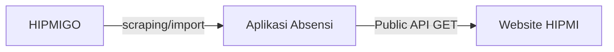

## 3. Pemisahan Konsep Status

### 3.1 Membership Status

- Lokasi: `Participant.membership_status`
- Menjawab: "Orang ini secara organisasi termasuk kategori apa?"
- Value: Anggota Biasa, Anggota Luar Biasa, Calon Undangan

| Status | Sumber |
|--------|--------|
| Anggota Biasa | HIPMIGO / Manual |
| Anggota Luar Biasa | HIPMIGO / Manual |
| Calon Undangan | Manual di aplikasi absensi |

Catatan: tidak menentukan hak seseorang di MUSCAB; hanya menjelaskan kategori anggota/orang.

### 3.2 Participation Status

- Lokasi: `Registration.participation_status`
- Menjawab: "Orang ini hadir dalam event MUSCAB sebagai apa?"
- Value: DPS, Peserta Utusan (DPT), Peninjau, Undangan, Undangan Resmi

Contoh: Budi — Membership: Anggota Biasa; Registration MUSCAB XI: Peserta Utusan (DPT).

### 3.3 Approval Status

- Lokasi: sistem pengajuan website HIPMI
- Menjawab: "Bagaimana status proses verifikasi administrasinya?"
- Value: Pending, Approved, Rejected

Catatan: tidak menggantikan Participation Status.

## 4. Lifecycle Kepesertaan

### 4.1 Anggota Biasa

Kondisi awal: Membership = Anggota Biasa, Participation = DPS.

Pengajuan:

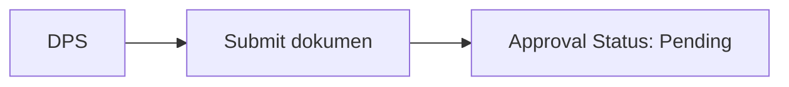

Jika disetujui:

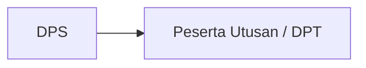

### 4.2 Pengurus

Tidak punya status khusus; Membership tetap Anggota Biasa, admin mengetahuinya via informasi administratif.

Default approve:

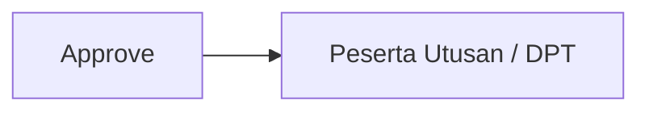

Tersedia opsi lain:

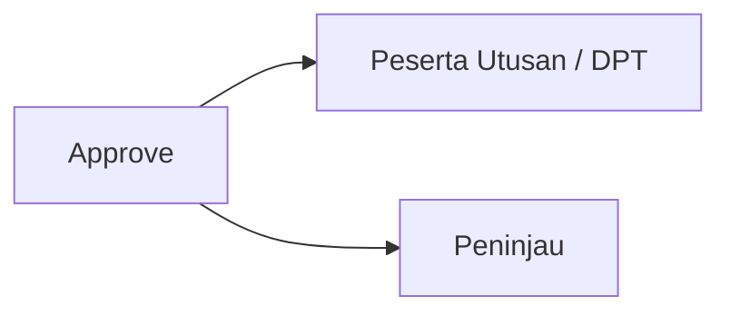

Jika Peninjau dipilih:

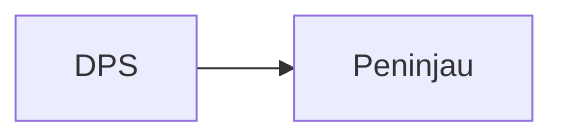

Perubahan Peninjau → Peserta Utusan (DPT) dilakukan manual di aplikasi absensi saat event berlangsung — bukan bagian workflow website HIPMI.

### 4.3 Anggota Luar Biasa

Tidak melalui proses DPS. Membership = Anggota Luar Biasa → Participation = Undangan.

### 4.4 Calon Undangan

Kategori manual di aplikasi absensi. Membership = Calon Undangan → Participation = Undangan Resmi.

## 5. Perbedaan Undangan vs Undangan Resmi

- `Calon Undangan` (Membership Status) → kategori orang secara organisasi.
- `Undangan` / `Undangan Resmi` (Participation Status) → hak kehadiran dalam MUSCAB.

Contoh: Participant A: Anggota Luar Biasa + Undangan. Participant B: Calon Undangan + Undangan Resmi.

## 6. Flow Website HIPMI

Website HIPMI tidak memasukkan peserta baru ke DPS; DPS berasal dari aplikasi absensi.

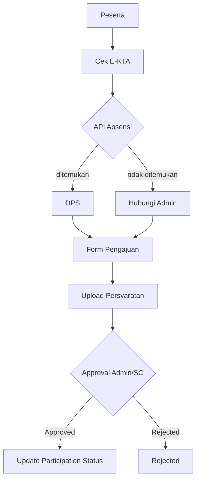

## 7. Tanggung Jawab Sistem

| Data | Source of Truth |
|------|-----------------|
| Participant | Aplikasi Absensi |
| Membership Status | Aplikasi Absensi |
| Registration Event | Aplikasi Absensi |
| Participation Status | Aplikasi Absensi |
| Request perubahan kepesertaan | Website HIPMI |
| Approval keputusan | Website HIPMI |

## 8. Prinsip Utama

1. Membership Status dan Participation Status adalah dua konsep berbeda.
2. Membership Status menjelaskan kategori orang.
3. Participation Status menjelaskan posisi orang dalam event tertentu.
4. Approval Status hanya menjelaskan proses administrasi.
5. Website HIPMI hanya mengelola pengajuan perubahan kepesertaan.
6. Aplikasi absensi tetap menjadi sumber utama status kepesertaan event.
7. Perubahan operasional event seperti Peninjau menjadi Peserta Utusan dilakukan melalui aplikasi absensi.

---

# Bagian II: Implementasi API & Perubahan Sistem

## 9. Temuan API Publik Saat Ini

Sebagian sudah mendukung konsep baru, sebagian perlu diubah agar lifecycle DPT/Peninjau berjalan tanpa mencampur data absensi dan website HIPMI.

### 9.1 GET /api/public/daftar-pemilih-sementara

Saat ini mengembalikan `membership_type` — ambigu, karena endpoint ini konteksnya peserta event (bukan membership):

```json
{ "membership_type": { "name": "Anggota Tetap", "slug": "anggota-tetap" } }
```

Sebaiknya:

```json
{
  "membership_status": { "name": "Anggota Biasa", "slug": "anggota-biasa" },
  "participation_status": { "name": "DPS", "slug": "dps" }
}
```

### 9.2 GET /api/public/participant/check-by-id

Hanya menjawab "Apakah orang ini ada di database participant?". Belum menjawab: ikut MUSCAB? status DPS/DPT? sedang mengajukan? pernah ditolak? sudah approve?

Padahal kebutuhan website: "Apakah saya terdaftar sebagai peserta MUSCAB dan bagaimana status saya?" → kurang tepat untuk flow utama.

### 9.3 GET /api/public/participant/check

Lebih dekat karena sudah ada `registration`, tapi masih pakai konsep lama:

```json
{ "participation_type": { "name": "Peserta Tetap" } }
```

Harus menjadi:

```json
{ "participation_status": { "name": "DPS", "slug": "dps" } }
```

## 10. Konsep Baru Cek Kepesertaan

Flow website mencari status kepesertaan event, bukan status member:

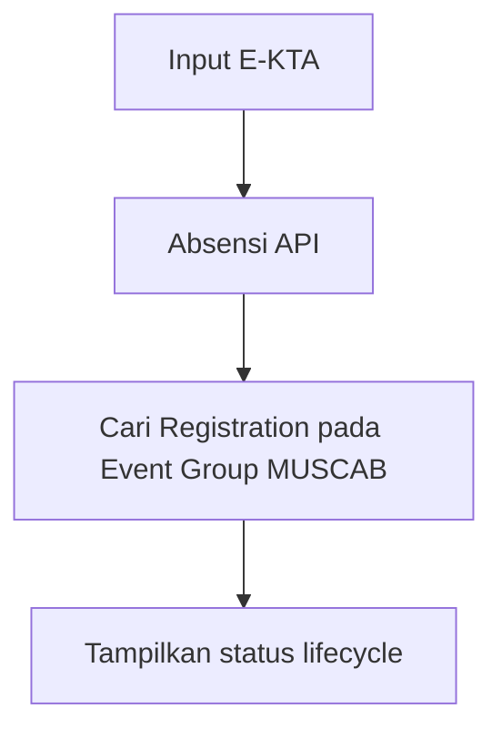

## 11. Response Cek Kepesertaan Baru

Endpoint baru `GET /api/public/participant/event-status` (atau extend `check-by-id`):

```json
{
  "found": true,
  "participant": {
    "id": "uuid",
    "name": "Peserta 1 Santoso",
    "company": "PT ABC",
    "identification_number": "3273"
  },
  "membership_status": { "name": "Anggota Biasa", "slug": "anggota-biasa" },
  "registration": {
    "event_group": { "id": "xxx", "name": "MUSCAB BPC HIPMI Kota Bandung" },
    "participation_status": { "name": "DPS", "slug": "dps" },
    "approval": { "status": "not_submitted", "label": "Belum Mengajukan" }
  }
}
```

## 12. Lifecycle Status Website HIPMI

Absensi hanya tahu DPS/DPT/Peninjau/Undangan; website HIPMI perlu tahu proses:

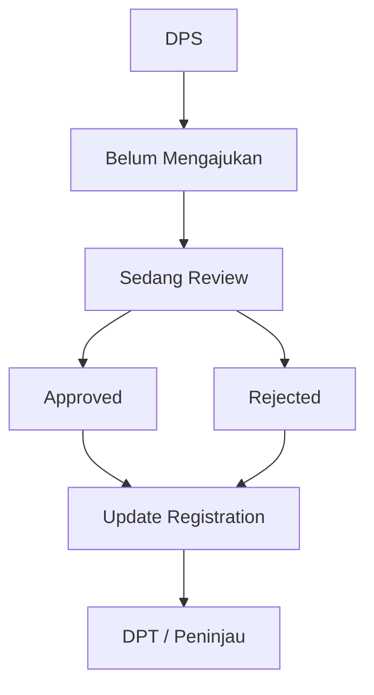

Data tambahan disimpan di website HIPMI, bukan di Registration absensi. Tabel: `participant_status_requests` (atau `participant_registration_requests`):

| Kolom | Keterangan |
|-------|------------|
| id | |
| participant_id | |
| event_group_id | |
| current_status | DPS |
| requested_status | DPT/Peninjau |
| approval_status | pending/approved/rejected |
| notes | |
| approved_by | |
| approved_at | |

## 13. Saat Approve

Website HIPMI dan aplikasi absensi adalah **dua sistem production terpisah** (beda domain, beda server). Komunikasi lewat HTTP request, bukan panggilan dalam proses — sehingga PUT dari website ke absensi bisa gagal (timeout, error 5xx) dan harus selalu ditangani.

### 13.1 Urutan Approve

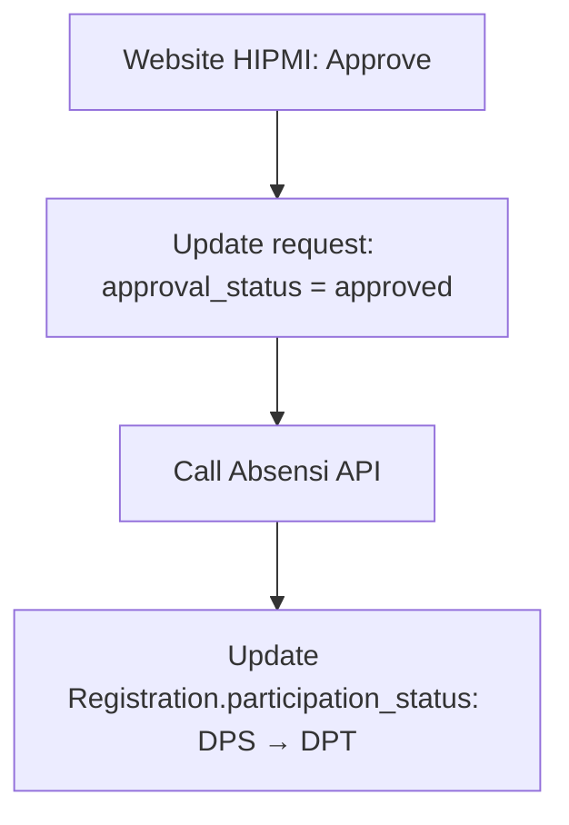

Prinsip: website menyimpan proses approval; absensi menyimpan status final peserta (source of truth).

### 13.2 Konsistensi & Retry

`approval_status` jangan di-set `approved` sebelum PUT ke absensi sukses — karena itu menentukan apakah status final benar-benar ter-update di absensi. State sync yang perlu disimpan di `participant_status_requests`:

| State | Arti |
|-------|------|
| `approved` | Disetujui, PUT belum dijalankan |
| `synced` | PUT sukses, status absensi sudah ter-update |
| `update_failed` | PUT gagal, perlu retry |

Catatan:

- Endpoint `/api/internal/registrations/{id}/participation-status` adalah **private antar-sistem** (bukan internal dalam arti satu server) — butuh auth antar-sistem seperti API token.
- Jika PUT gagal → set `update_failed`, admin melakukan retry manual.
- Queue (worker) baru dipertimbangkan jika ada bulk approve atau absensi sering lambat/down — untuk satu event, retry manual cukup.

## 14. API Baru yang Dibutuhkan

GET status peserta (dari absensi, untuk website):

```text
GET /api/public/event-groups/{id}/participant/status
```

```json
{
  "participant": {},
  "registration": {
    "participation_status": { "name": "DPS" }
  }
}
```

PUT update status (bukan public, dipanggil saat approve):

```text
PUT /api/internal/registrations/{id}/participation-status
```

```json
{ "participation_status": "peserta-utusan" }
```

## 15. Perubahan Model Naming

Fitur sekarang bukan hanya peserta tetap (ada DPT, Peninjau, kemungkinan Utusan):

| Sekarang | Menjadi |
|----------|---------|
| PesertaTetapRegistration | ParticipantStatusRequest |
| PesertaTetapRegistrationController | ParticipantStatusRequestController (`store()` untuk submit) |
| PesertaTetapController | ParticipantStatusApprovalController (tugas approval) |

## 16. Perubahan Database Laravel

`peserta_tetap_registrations` → `participant_status_requests`

| Lama | Baru |
|------|------|
| participant_id | participant_id |
| nomor_kta | identification_number |
| status_keanggotaan | membership_status_snapshot |
| status_validasi | approval_status |
| notes | notes |
| validated_by | approved_by |
| validated_at | approved_at |

Tambahan: `requested_status` (contoh: `peserta-utusan`, `peninjau`).

## 17. Kesimpulan

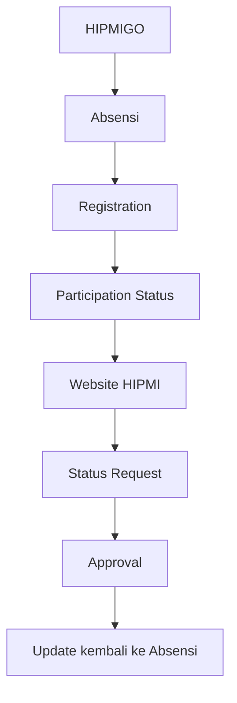

Website HIPMI bukan pemilik status peserta, melainkan workflow approval layer — konsisten dengan keputusan bahwa aplikasi absensi adalah sumber data utama.
