# Business Logic — Integrasi 3 Website

**Date:** 15 August 2026  
**Status:** Draft — Menunggu Approval  
**Revisi:** 1 — Koreksi flow integrasi

---

## Daftar Isi

1. [Overview](#overview)
2. [Arsitektur](#arsitektur)
3. [Split Responsibility](#split-responsibility)
4. [Business Logic per Domain](#business-logic-per-domain)
5. [Endpoint Strategy](#endpoint-strategy)
6. [Data Flow Diagram](#data-flow-diagram)
7. [Phase Implementation](#phase-implementation)
8. [Risk & Mitigation](#risk--mitigation)

---

## Overview

Sistem informasi HIPMI Kota Bandung terdiri dari 3 website yang saling terintegrasi secara **berjenjang**:

| Website | URL | Fungsi | Source of Truth |
|---------|-----|--------|-----------------|
| **hipmigo** | — | Pusat Pengelolaan Data Anggota | Data Anggota, Membership, e-KTA |
| **absensi.hipmibdg.or.id** | absensi.hipmibdg.or.id | Event & Absensi | Event, Registrasi, Kehadiran |
| **hipmibdg.or.id** | hipmibdg.or.id | Company Profile HIPMI | Tampilan publik data |

### Aliran Data

```
hipmigo (pusat data anggota)
    │
    ▼  Data anggota di-pull
absensi.hipmibdg.or.id (event + absensi)
    │
    ▼  Data event/kehadiran di-pull
hipmibdg.or.id (company profile)
```

**Prinsip:** Data bersifat **on-demand pull** melalui **public API** (tanpa autentikasi, read-only).

---

## Arsitektur

```
┌─────────────────────────────────────────────────────────────┐
│                    INTEGRASI 3 WEBSITE                      │
├─────────────────────────────────────────────────────────────┤
│                                                             │
│  ┌──────────────────┐                                       │
│  │    hipmigo       │                                       │
│  │  (Pusat Data     │                                       │
│  │   Anggota)       │                                       │
│  └────────┬─────────┘                                       │
│           │                                                 │
│           │  Data Anggota                                   │
│           │  (email, nama, KTA, membership)                 │
│           ▼                                                 │
│  ┌──────────────────────────────┐                           │
│  │  absensi.hipmibdg.or.id     │                           │
│  │  (Event + Absensi)           │                           │
│  │                              │                           │
│  │  Source of Truth:            │                           │
│  │  - Event, Registrasi         │                           │
│  │  - Kehadiran (absensi)       │                           │
│  │  - QR Code                   │                           │
│  └────────┬─────────────────────┘                           │
│           │                                                 │
│           │  Data Event & Kehadiran                         │
│           │  (daftar event, DPS, statistik absensi)         │
│           ▼                                                 │
│  ┌──────────────────┐                                       │
│  │  hipmibdg.or.id  │                                       │
│  │  (Company Profile)│                                      │
│  │                              │                           │
│  │  Menampilkan:                │                           │
│  │  - Profil anggota            │                           │
│  │  - Daftar event              │                           │
│  │  - Status kehadiran          │                           │
│  └──────────────────┘                                       │
│                                                             │
└─────────────────────────────────────────────────────────────┘
```

---

## Split Responsibility

### 1. hipmigo — Source of Truth: Data Anggota

hipmigo adalah **pusat pengelolaan data anggota** HIPMI. Semua data keanggotaan berasal dari sini.

| Data | Keterangan | Format |
|------|------------|--------|
| Nama Anggota | Identitas lengkap | String |
| Email | Unique identifier | String (unique) |
| Gender | L/P | Enum |
| Perusahaan | Asal perusahaan | String |
| Tipe Identitas | KTP/KTA/Passport/Other | Enum |
| Nomor Identitas | e-KTA, KTP, dll | String (nullable) |
| Tipe Keanggotaan | Tetap/Biasa/Luar Biasa | FK → MembershipType |
| Foto Profil | Image URL | String (nullable) |

**Kapan data ini di-pull?**
- Saat admin absensi membuat registrasi → cek apakah peserta sudah ada di sistem
- Saat validasi e-KTA → cek nomor identitas
- Saat import peserta dari CSV → lookup existing anggota

### 2. absensi.hipmibdg.or.id — Source of Truth: Event & Absensi

absensi.hipmibdg.or.id adalah **sistem utama untuk event dan absensi**. Mengambil data anggota dari hipmigo, lalu menyimpan data event dan kehadiran.

| Data | Keterangan | Format |
|------|------------|--------|
| Event Group | Kumpulan event (misal: Kongres) | Object |
| Event | Acara dalam event group | Object |
| Session | Sesi dalam event | Object |
| Registrasi | Pendaftaran peserta ke event | Object |
| Kehadiran | Check-in / Check-out | Object |
| QR Code | Tiket masuk unik | UUID |

**Kapan data ini di-pull?**
- Saat hipmibdg.or.id menampilkan daftar event → pull event list
- Saat hipmibdg.or.id menampilkan DPS → pull daftar pemilih
- Saat hipmibdg.or.id menampilkan statistik kehadiran → pull attendance

### 3. hipmibdg.or.id — Tampilan Publik (Company Profile)

hipmibdg.or.id adalah **website company profile** yang menampilkan data dari absensi.hipmibdg.or.id. Tidak memiliki database sendiri, semua data di-pull on-demand.

| Fitur | Data yang Ditampilkan | Sumber |
|-------|----------------------|--------|
| Profil Anggota | Nama, foto, perusahaan, status keanggotaan | absensi (→ hipmigo) |
| Daftar Event | Nama, tanggal, jumlah peserta | absensi |
| DPS | Daftar pemilih sementara | absensi |
| Status Registrasi | Apakah sudah terdaftar di event | absensi |
| Kehadiran | Rekap absensi per event | absensi |

---

## Business Logic per Domain

### Domain 1: Manajemen Anggota (hipmigo → absensi)

```
hipmigo (create/update anggota)
    │
    ▼  Data anggota di-pull
absensi.hipmibdg.or.id (pull on-demand via public API)
    │
    ├── GET /member/check (validasi keanggotaan by email)
    ├── GET /participant/check-by-email (lookup by email)
    ├── GET /participant/check-by-id (lookup by KTA)
    └── GET /participant/detail (profil lengkap + riwayat)
```

**Aturan Bisnis:**
1. Anggota yang terdaftar di hipmigo bisa langsung didaftarkan di absensi
2. Email digunakan sebagai unique identifier utama (bukan ID)
3. Jika anggota belum ada di absensi, sistem akan auto-create saat registrasi pertama kali
4. Tipe keanggotaan (Tetap/Biasa/Luar Biasa) menentukan auto-assign participation type
5. Data anggota bersifat **read-only** di absensi — tidak bisa diubah dari sini

### Domain 2: Event & Registrasi (absensi → hipmibdg.or.id)

```
absensi.hipmibdg.or.id (create event & registrasi)
    │
    ▼  Data event di-pull
hipmibdg.or.id (pull on-demand via public API)
    │
    ├── GET /event-groups (daftar event)
    ├── GET /event-groups/:id (detail event)
    ├── GET /event-groups/:id/events (event + sesi)
    ├── GET /event-groups/:id/registrations (daftar peserta)
    ├── GET /event-groups/:id/attendance (statistik kehadiran)
    └── GET /daftar-pemilih-sementara (DPS)
```

**Aturan Bisnis:**
1. Event group memiliki event-event di dalamnya
2. Setiap event memiliki sesi-sesi
3. Peserta mendaftar ke event group (bukan ke event individual)
4. QR Code unik dibuat per registrasi
5. Kehadiran dicatat per event (check-in dan check-out)
6. Data event bersifat **read-only** di hipmibdg.or.id

### Domain 3: Absensi & Kehadiran

```
absensi.hipmibdg.or.id (record kehadiran via scan QR)
    │
    ├──→ hipmibdg.or.id (pull statistik kehadiran untuk ditampilkan)
    │    └── GET /event-groups/:id/attendance
    │
    └──→ hipmigo (pull riwayat kehadiran per anggota untuk monitoring)
         └── GET /participant/:id/attendance
```

**Aturan Bisnis:**
1. Check-in: Scan QR → sistem catat waktu + event + session
2. Check-out: Scan QR lagi → sistem catat waktu keluar
3. Satu peserta bisa check-in di multiple events dalam 1 event group
4. Kehadiran dihitung berdasarkan jumlah check-in (bukan checkout)
5. Checkout bersifat opsional (tidak semua event mencatat checkout)

### Domain 4: Auto Role Mapping

```
Saat registrasi di absensi:
    participant.membership_type (dari hipmigo) → lookup mapping → participant.participation_type

Mapping:
    anggota-luar-biasa  →  undangan
    anggota-biasa       →  peserta-utusan
    calon-undangan      →  undangan-resmi

Aturan:
    1. Mapping hanya berlaku saat create registrasi
    2. Admin bisa override manual
    3. Jika participation type tidak tersedia di event group → set null
```

---

## Endpoint Strategy

### Prinsip

| Prinsip | Penjelasan |
|---------|------------|
| **Public (No Auth)** | Semua endpoint bisa diakses tanpa autentikasi |
| **Read-Only** | Hanya GET, tidak ada POST/PUT/DELETE |
| **On-Demand** | Data di-pull saat dibutuhkan, bukan push |
| **Rate Limited** | 300 req/min per IP (global default) |
| **RESTful** | Konsisten dengan konvensi REST |

### Endpoint Map

#### Endpoint yang Sudah Ada (7 endpoints)

| # | Endpoint | Fungsi | Consumer |
|---|----------|--------|----------|
| 1 | `GET /event-groups` | Daftar semua event | hipmibdg.or.id |
| 2 | `GET /participant/check` | Cek registrasi by email | hipmibdg.or.id |
| 3 | `GET /participant/check-by-id` | Lookup anggota by KTA | hipmigo |
| 4 | `GET /participant/check-by-email` | Lookup anggota by email | hipmigo |
| 5 | `GET /participant/detail` | Profil lengkap + riwayat | hipmigo |
| 6 | `GET /member/check` | Validasi keanggotaan | hipmigo |
| 7 | `GET /daftar-pemilih-sementara` | DPS untuk event | hipmibdg.or.id |

#### Endpoint yang Perlu Ditambah (6 endpoints baru)

| # | Endpoint | Fungsi | Consumer |
|---|----------|--------|----------|
| 8 | `GET /event-groups/:id` | Detail 1 event group | hipmibdg.or.id |
| 9 | `GET /event-groups/:id/events` | Event + sesi dalam 1 group | hipmibdg.or.id |
| 10 | `GET /event-groups/:id/attendance` | Statistik kehadiran | hipmibdg.or.id |
| 11 | `GET /event-groups/:id/registrations` | Daftar peserta (filterable) | hipmibdg.or.id |
| 12 | `GET /participant/:id/attendance` | Kehadiran 1 anggota di 1 event group | hipmigo |
| 13 | `GET /analytics/summary` | Statistik agregat publik | hipmibdg.or.id |

---

## Data Flow Diagram

### Flow 1: Pendaftaran Anggota Baru

```
1. Anggota buka hipmibdg.or.id → lihat daftar event
2. Klik "Daftar" → redirect ke absensi.hipmibdg.or.id
3. Absensi pull data anggota dari hipmigo (via public API)
   └── GET /member/check?email=xxx
4. Absensi pull event dari absensi (data sendiri)
5. Anggota mengisi form → submit registrasi
6. Absensi create registrasi + generate QR code
7. Email tiket dikirim ke anggota
```

### Flow 2: Absensi di Lokasi

```
1. Peserta datang ke lokasi acara
2. Panitia buka aplikasi scan QR (absensi.hipmibdg.or.id)
3. Peserta tunjukkan QR code dari email
4. Panitia scan → sistem validasi QR
5. Sistem catat: registration_id, event_id, session_id, type=checkin, timestamp
6. Data kehadiran tersimpan di absensi
7. hipmibdg.or.id bisa pull statistik kehadiran secara real-time
```

### Flow 3: Monitoring Keanggotaan (hipmigo)

```
1. Admin hipmigo ingin cek riwayat kehadiran anggota
2. Buka hipmigo → masukkan email/nomor KTA
3. hipmigo pull data dari absensi (via public API)
   └── GET /participant/detail?identification_number=xxx
4. Tampilkan: profil anggota + riwayat event + status kehadiran
```

### Flow 4: Company Profile (hipmibdg.or.id)

```
1. Pengunjung buka hipmibdg.or.id
2. Lihat daftar event (pull dari absensi)
   └── GET /event-groups
3. Klik 1 event → lihat detail, jumlah peserta, statistik kehadiran
   └── GET /event-groups/:id
   └── GET /event-groups/:id/attendance
4. Lihat DPS (Daftar Pemilih Sementara) untuk event tertentu
   └── GET /daftar-pemilih-sementara?event_group_id=xxx
5. Semua data di-pull on-demand dari absensi
```

### Ringkasan Aliran Data

```
┌─────────────┐     pull anggota      ┌─────────────────────────┐     pull event     ┌─────────────────┐
│   hipmigo   │ ────────────────────► │ absensi.hipmibdg.or.id │ ──────────────────► │ hipmibdg.or.id  │
│             │                       │                         │                     │                 │
│ Data Anggota│ ◄──────────────────── │ Data Event & Absensi    │ ◄───────────────── │ Company Profile │
│ Membership  │     (read-only)       │ Registrasi              │     (display only)  │ Tampilan Publik │
│ e-KTA       │                       │ Kehadiran               │                     │                 │
└─────────────┘                       └─────────────────────────┘                     └─────────────────┘
```

---

## Phase Implementation

### Phase 1: Backend — Public API Expansion

**Estimasi:** 2-3 hari  
**File:** `src/modules/public/public.controller.ts` + `public.route.ts`

| Task | Endpoint | Consumer | Detail |
|------|----------|----------|--------|
| 1.1 | `GET /event-groups/:id` | hipmibdg.or.id | Detail event group + count event |
| 1.2 | `GET /event-groups/:id/events` | hipmibdg.or.id | Event + session list |
| 1.3 | `GET /event-groups/:id/attendance` | hipmibdg.or.id | Statistik kehadiran aggregate |
| 1.4 | `GET /event-groups/:id/registrations` | hipmibdg.or.id | Daftar peserta filterable |
| 1.5 | `GET /participant/:id/attendance` | hipmigo | Kehadiran 1 anggota di 1 event group |
| 1.6 | `GET /analytics/summary` | hipmibdg.or.id | Statistik agregat publik |
| 1.7 | Register routes | — | Update `public.route.ts` |
| 1.8 | Zod schemas | — | Validasi input untuk semua endpoint baru |

### Phase 2: Backend — Documentation

**Estimasi:** 1 hari

| Task | File | Detail |
|------|------|--------|
| 2.1 | Update `docs/PUBLIC_API.md` | Dokumentasi semua 13 endpoints |
| 2.2 | Buat `docs/INTEGRATION_GUIDE.md` | Panduan integrasi untuk tim hipmibdg & hipmigo |

### Phase 3: Integration Testing

**Estimasi:** 1-2 hari

| Task | Keterangan |
|------|------------|
| 3.1 | Test semua 13 public endpoints |
| 3.2 | Test rate limiting (300 req/min) |
| 3.3 | Test edge cases (data tidak ada, parameter salah) |
| 3.4 | Mock integrasi: absensi → hipmibdg.or.id |
| 3.5 | Mock integrasi: hipmigo → absensi |

### Phase 4: Deployment & Monitoring

**Estimasi:** 1 hari

| Task | Keterangan |
|------|------------|
| 4.1 | Deploy backend ke production |
| 4.2 | Share API docs ke tim hipmibdg.or.id |
| 4.3 | Share API docs ke tim hipmigo |
| 4.4 | Monitor usage & rate limiting |

---

## Risk & Mitigation

| Risk | Impact | Mitigation |
|------|--------|------------|
| Rate limit terlalu rendah | hipmibdg.or.id tidak bisa akses data | Monitor usage, tingkatkan limit jika perlu |
| Data anggota tidak sinkron | Anggota tidak bisa daftar event | Auto-create participant saat registrasi pertama |
| Public API disalahgunakan (scraping) | Performa menurun | Tambah CAPTCHA atau API key jika diperlukan |
| Perubahan schema tanpa notice | Integrasi breaking | Versioning API (/api/public/v2/) |
| QR code bocor | Kehadiran palsu | Validasi di lokasi (nama + KTA) |
| hipmigo down | Absensi tidak bisa pull data anggota | Cache data anggota lokal, fallback ke data existing |

---

## Status Dokumen

| Item | Status |
|------|--------|
| Business Logic | ✅ Draft |
| Endpoint Specification | ✅ Draft |
| Phase Plan | ✅ Draft |
| Review dari Tim | ⏳ Menunggu |
| Approval | ⏳ Menunggu |
| Implementasi | ⏳ Belum Mulai |

---

# Brainstorming: Alur Status Kepesertaan & Anggota

**Date:** 15 August 2026  
**Status:** Brainstorming — Menunggu Keputusan PM  
**Context:** Analisis kelengkapan alur status anggota dan kepesertaan dari awal sampai akhir

---

## Daftar Isi — Brainstorming

1. [Kondisi Saat Ini](#kondisi-saat-ini)
2. [Gap Analysis](#gap-analysis)
3. [Target State (Alur yang Diharapkan)](#target-state)
4. [Diagram Alur Status](#diagram-alur-status)
5. [Validasi 1 e-KTA = 1 Registrasi](#validasi-1-ekta--1-registrasi)
6. [Rekomendasi Update](#rekomendasi-update)
7. [Decision Points untuk PM](#decision-points-untuk-pm)

---

## Kondisi Saat Ini

### Status Anggota (Membership)

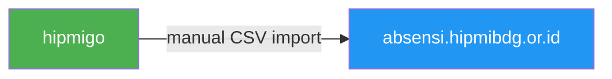

| Aspek | Kondisi | Keterangan |
|-------|---------|------------|
| Membership types | 3 tipe | Anggota Tetap, Biasa, Luar Biasa |
| Field di Participant | `membership_type_id` | Nullable, bisa null |
| Status active/inactive | **TIDAK ADA** | Participant hanya ada atau tidak ada |
| Sync hipmigo → absensi | **Manual** | Export CSV lalu import manual |
| Perubahan membership | Bisa diubah admin | Via inline edit atau bulk update |

### Status Kepesertaan (Participation)

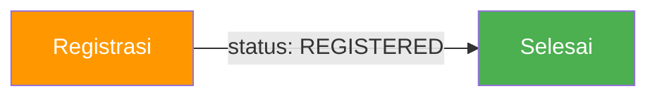

| Aspek | Kondisi | Keterangan |
|-------|---------|------------|
| Participation types | 5 seeded + 3 planned | Peserta Tetap, Peninjau, Undangan, VIP, Reguler + (Peserta Utusan, Undangan Resmi, Calon Undangan) |
| Registration status | `"REGISTERED"` saja | Hanya 1 status, tidak ada transisi |
| DPS → DPT | **TIDAK ADA** | Semua registrasi langsung muncul di DPS |
| Approval workflow | **TIDAK ADA** | Registrasi langsung aktif |
| Validasi e-KTA | **TIDAK ADA** | 1 e-KTA bisa daftar berkali-kali |

---

## Gap Analysis

### Gap 1: Tidak Ada Status Anggota (Active/Inactive)

**Kondisi:** Participant tidak punya field `status`. Data hanya ada atau tidak ada.

**Dampak:**
- Tidak bisa menandai anggota yang sudah tidak aktif
- Tidak bisa membatasi anggota non-aktif untuk mendaftar event
- Data anggota dari hipmigo tidak bisa di-sync status aktif/inaktifnya

**Yang perlu ditambah:**
- Field `status` di Participant model: `"ACTIVE" | "INACTIVE" | "SUSPENDED"`
- Default `"ACTIVE"` saat create
- hipmigo bisa set status saat data anggota berubah
- Absensi harus pull status terbaru dari hipmigo

### Gap 2: Tidak Ada Transisi DPS → DPT

**Kondisi:** Semua registrasi langsung masuk DPS. Tidak ada proses verifikasi/approval menjadi DPT.

**Dampak:**
- Tidak ada tahap verifikasi sebelum peserta dianggap resmi
- Semua yang daftar otomatis jadi pemilih tanpa validasi
- Tidak ada mekanisme reject/batalkan registrasi

**Yang perlu ditambah:**
- Status di Registration: `"PENDING" | "APPROVED" | "REJECTED" | "REGISTERED" | "CANCELLED"`
- Alur: `PENDING (DPS) → APPROVED (DPT) → REGISTERED (Aktif)`
- Admin bisa approve/reject registrasi
- DPS hanya menampilkan status `PENDING`
- DPT menampilkan status `APPROVED`

### Gap 3: Tidak Ada Validasi 1 e-KTA = 1 Registrasi

**Kondisi:** `identification_number` tidak punya unique constraint. Dua participant berbeda bisa punya e-KTA yang sama.

**Dampak:**
- Satu orang bisa mendaftar berkali-kali ke event yang sama
- Data DPS tidak akurat (duplikasi)
- Untuk MUSCAB: pelanggaran aturan 1 e-KTA = 1 suara

**Yang perlu ditambah:**
- Validasi di backend sebelum create registrasi
- Cek apakah sudah ada participant lain dengan `identification_number` sama yang sudah terdaftar di event group yang sama
- Error message: "e-KTA [nomor] sudah terdaftar di event group ini"

### Gap 4: Auto Role Mapping Belum Diimplementasi

**Kondisi:** Documentation bilang mapping ada, tapi kode belum ada.

**Dampak:**
- Admin harus manual assign participation type untuk setiap peserta
- Rentan kesalahan input
- Tidak konsisten

**Mapping yang direncanakan:**
- `anggota-luar-biasa → undangan`
- `anggota-biasa → peserta-utusan`
- `calon-undangan → undangan-resmi`

### Gap 5: Data Sync hipmigo → Absensi Masih Manual

**Kondisi:** Export CSV dari hipmigo, lalu import manual ke absensi.

**Dampak:**
- Data bisa outdated (perubahan di hipmigo belum tentu di-absensi)
- Butuh effort manual untuk sync
- Resiko human error saat import

### Gap 6: 6 Public Endpoint Baru Belum Dibuat

**Kondisi:** Documentation sudah spesifikasi tapi belum diimplementasi.

**Endpoint yang perlu ditambah:**
1. `GET /event-groups/:id` — Detail event group
2. `GET /event-groups/:id/events` — Event + sesi
3. `GET /event-groups/:id/attendance` — Statistik kehadiran
4. `GET /event-groups/:id/registrations` — Daftar peserta
5. `GET /participant/:id/attendance` — Kehadiran per anggota
6. `GET /analytics/summary` — Statistik agregat

---

## Target State

### Alur Lengkap Status Anggota

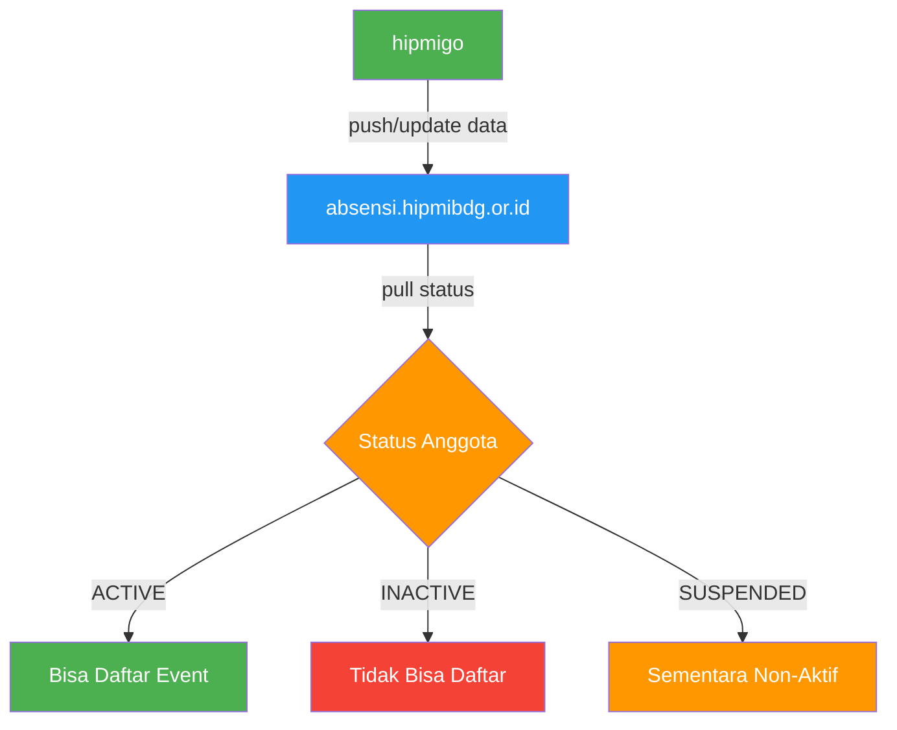

| Field | Tipe | Nilai | Default | Keterangan |
|-------|------|-------|---------|------------|
| `status` | Enum | `ACTIVE`, `INACTIVE`, `SUSPENDED` | `ACTIVE` | Status keanggotaan |
| `status_updated_at` | DateTime | — | `created_at` | Kapan status terakhir diubah |
| `status_updated_by` | String | — | `null` | Siapa yang ubah status |

### Alur Lengkap Status Kepesertaan (DPS → DPT)

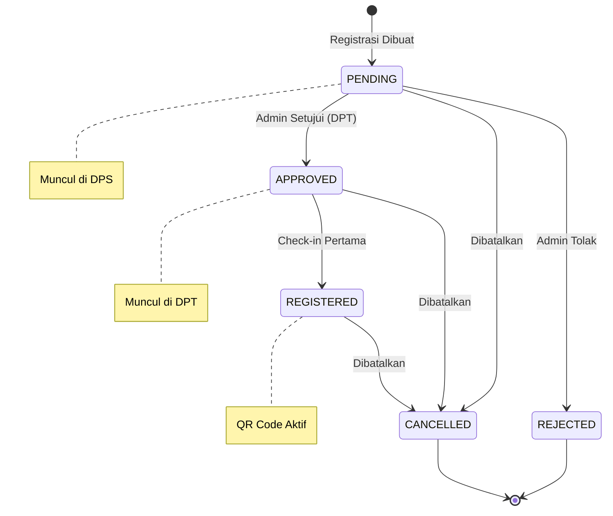

| Status | Keterangan | Muncul di | QR Code | Bisa Check-in |
|--------|------------|-----------|---------|---------------|
| `PENDING` | Baru didaftarkan, menunggu verifikasi | DPS | Belum aktif | Tidak |
| `APPROVED` | Disetujui sebagai pemilih tetap | DPT | Aktif | Ya |
| `REJECTED` | Ditolak oleh admin | Tidak ada | Tidak | Tidak |
| `REGISTERED` | Sudah check-in pertama kali | DPT | Aktif | Ya |
| `CANCELLED` | Dibatalkan oleh admin/peserta | Tidak ada | Non-aktif | Tidak |

### Alur Lengkap Registrasi (End-to-End)

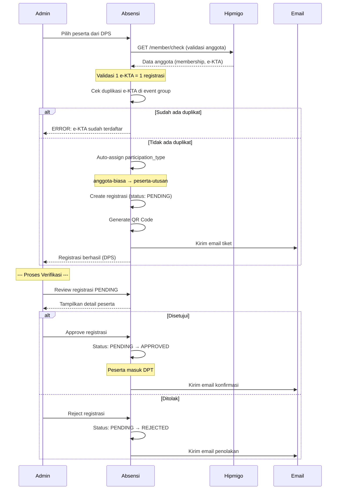

---

## Diagram Alur Status

### Diagram 1: Alur Status Anggota (Membership)

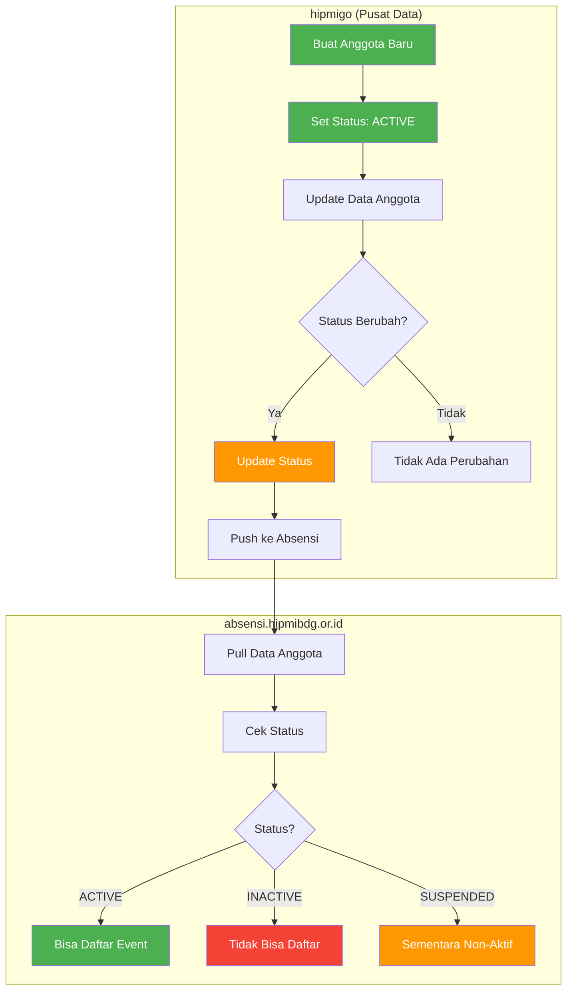

### Diagram 2: Alur DPS → DPT (Registration Status)

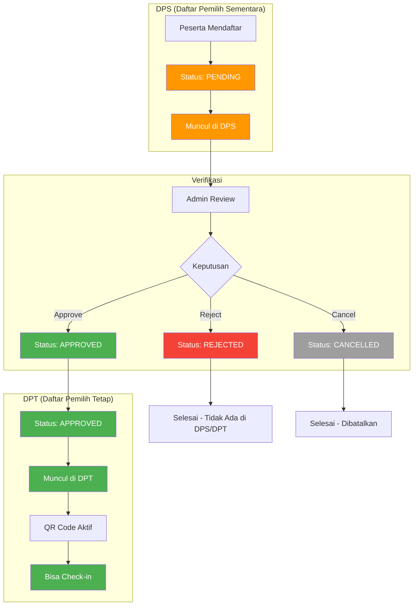

### Diagram 3: Validasi 1 e-KTA = 1 Registrasi

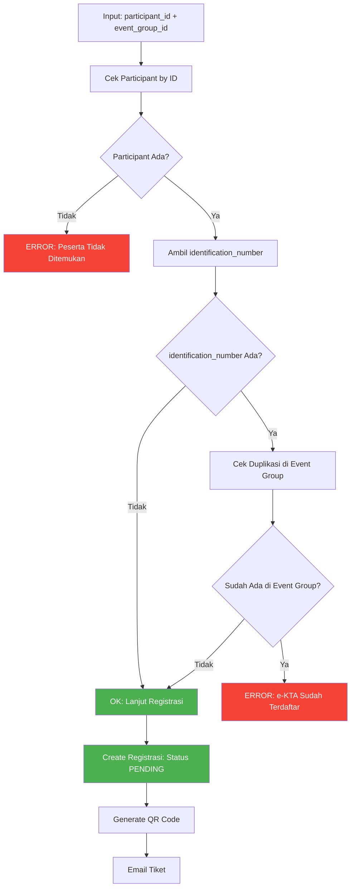

### Diagram 4: Auto Role Mapping

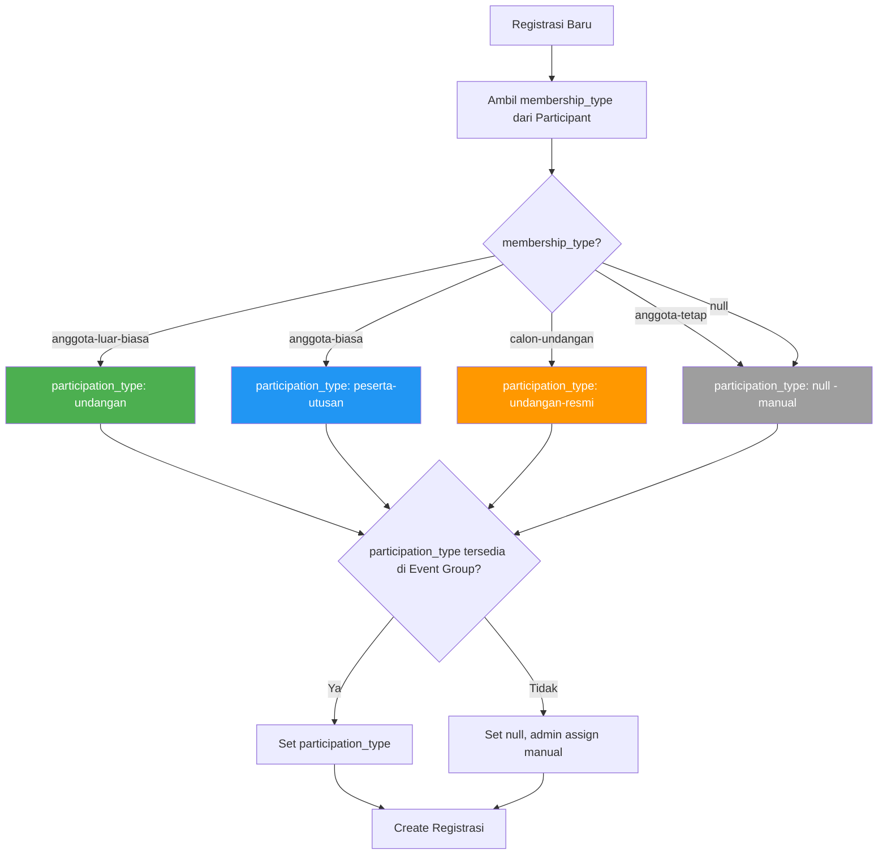

---

## Validasi 1 e-KTA = 1 Registrasi

### Problem Statement

Untuk use case MUSCAB (Musyawarah Cabang), aturan penting adalah:
> **1 e-KTA = 1 hak suara = 1 registrasi per event group**

Saat ini **tidak ada validasi** untuk ini. Dua participant berbeda bisa punya e-KTA yang sama, atau participant yang sama bisa didaftarkan berkali-kali (meskipun ada cek event_group_id unik per participant).

### Solusi yang Direkomendasikan

#### Opsi A: Validasi di Level Registration (Recommended)

```typescript
// Di registration.controller.ts, sebelum create registrasi
const existingRegistration = await prisma.registration.findFirst({
  where: {
    event_group_id: eventGroupId,
    participant: {
      identification_number: identificationNumber,
    },
  },
  include: { participant: true },
});

if (existingRegistration) {
  throw new Error(
    `e-KTA ${identificationNumber} sudah terdaftar di event group ini oleh ${existingRegistration.participant.name}`
  );
}
```

**Kelebihan:**
- Tidak mengubah schema database
- Fleksibel (bisa di-skip untuk event tertentu jika diperlukan)
- Mudah diimplementasi

**Kekurangan:**
- Duplikasi participant masih bisa terjadi (beda email, sama e-KTA)

#### Opsi B: Unique Constraint di identification_number

```prisma
model Participant {
  // ... existing fields
  identification_number String? @unique  // Tambah unique constraint
}
```

**Kelebihan:**
- Mencegah duplikasi participant secara fundamental
- Lebih ketat dan konsisten

**Kekurangan:**
- Mungkin ada data existing yang duplikat perlu dibersihkan
- Tidak semua participant punya e-KTA (nullable, tapi unique)

#### Opsi C: Kombinasi (Opsi A + B)

Gunakan Opsi B untuk mencegah duplikasi participant, dan Opsi A untuk validasi di registration.

### Rekomendasi: **Opsi A** (Validasi di Level Registration)

**Alasan:**
1. Tidak perlu ubah schema
2. Bisa di-skip untuk event tertentu (misal: event terbuka yang tidak pakai e-KTA)
3. Lebih fleksibel
4. Duplikasi participant bisa di-handle terpisah (clean data)

---

## Rekomendasi Update

### Prioritas 1: Validasi e-KTA (Critical — Harus Segera)

| Item | Detail |
|------|--------|
| **Scope** | Backend registration controller |
| **File** | `event-platform-be/src/modules/registrations/registration.controller.ts` |
| **Logic** | Sebelum create, cek apakah ada participant lain dengan `identification_number` sama yang sudah terdaftar di event group yang sama |
| **Error** | `"e-KTA [nomor] sudah terdaftar di event group ini oleh peserta lain"` |
| **Effort** | 0.5 hari |
| **Impact** | Mencegah duplikasi DPS, krusial untuk MUSCAB |

### Prioritas 2: Status Transisi Registration (High)

| Item | Detail |
|------|--------|
| **Scope** | Backend + Frontend |
| **Schema** | Tambah validasi enum: `PENDING`, `APPROVED`, `REJECTED`, `REGISTERED`, `CANCELLED` |
| **Default** | `"PENDING"` saat registrasi dibuat (bukan `REGISTERED`) |
| **Approval** | Admin bisa ubah status dari `PENDING` → `APPROVED` atau `REJECTED` |
| **DPS** | Filter DPS hanya tampilkan status `PENDING` |
| **DPT** | Filter DPT tampilkan status `APPROVED` |
| **Effort** | 2-3 hari |
| **Impact** | Alur verifikasi yang proper, DPS → DPT jelas |

### Prioritas 3: Auto Role Mapping (Medium)

| Item | Detail |
|------|--------|
| **Scope** | Backend registration controller |
| **Mapping** | `anggota-luar-biasa → undangan`, `anggota-biasa → peserta-utusan`, `calon-undangan → undangan-resmi` |
| **Logic** | Auto-assign saat registrasi dibuat, admin bisa override |
| **Effort** | 0.5 hari |
| **Impact** | Mengurangi manual input, konsistensi data |

### Prioritas 4: Status Anggota (Medium)

| Item | Detail |
|------|--------|
| **Scope** | Backend + Frontend + Integration |
| **Schema** | Tambah `status` field di Participant: `ACTIVE`, `INACTIVE`, `SUSPENDED` |
| **Default** | `"ACTIVE"` |
| **Integration** | hipmigo bisa push status update |
| **Effort** | 1-2 hari |
| **Impact** | Kontrol lebih baik atas data anggota aktif |

### Prioritas 5: Public Endpoints (Low — Bisa Nanti)

| Item | Detail |
|------|--------|
| **Scope** | Backend public controller |
| **Endpoints** | 6 endpoint baru (detail event, events, attendance, registrations, per-member attendance, analytics) |
| **Effort** | 2-3 hari |
| **Impact** | Integrasi dengan hipmibdg.or.id |

---

## Decision Points untuk PM

### Decision 1: Kapan Validasi e-KTA Harus Diimplementasi?

| Opsi | Keterangan | Rekomendasi |
|------|------------|-------------|
| **A. Sekarang (sebelum MUSCAB)** | Implementasi segera di registration controller | ✅ **Recommended** |
| **B. Setelah MUSCAB** | Tunda ke phase berikutnya | ❌ Tidak disarankan |
| **C. Optional per event** | Jadikan flag di event group (event_group.use_ekta_validation) | Pertimbangkan jika ada event yang tidak pakai e-KTA |

### Decision 2: Apakah Perlu Status DPS → DPT?

| Opsi | Keterangan | Rekomendasi |
|------|------------|-------------|
| **A. Ya, dengan approval workflow** | PENDING → APPROVED → REGISTERED | ✅ **Recommended** untuk MUSCAB |
| **B. Ya, tanpa approval** | PENDING → REGISTERED (langsung) | Cukup untuk event biasa |
| **C. Tidak perlu** | Tetap pakai sistem sekarang (REGISTERED saja) | ❌ Tidak disarankan untuk MUSCAB |

### Decision 3: Metode Sync Data hipmigo → Absensi?

| Opsi | Keterangan | Rekomendasi |
|------|------------|-------------|
| **A. Manual CSV import** | Tetap seperti sekarang | ✅ **Short-term** (cukup untuk sekarang) |
| **B. Webhook** | hipmigo push ke absensi saat data berubah | Ideal tapi butuh development di hipmigo |
| **C. Scheduled sync** | Cron job dari absensi pull data dari hipmigo | Pertimbangkan untuk jangka panjang |

### Decision 4: Apakah Perlu Status Anggota (Active/Inactive)?

| Opsi | Keterangan | Rekomendasi |
|------|------------|-------------|
| **A. Ya, segera** | Tambah field `status` di Participant | Pertimbangkan jika ada kebutuhan |
| **B. Ya, nanti** | Tunda ke phase berikutnya | ✅ **Short-term** (belum kritis) |
| **C. Tidak perlu** | Tetap seperti sekarang | Cukup jika tidak ada anggota non-aktif |

---

## Ringkasan Effort

| Prioritas | Item | Effort | Impact |
|-----------|------|--------|--------|
| **P1** | Validasi e-KTA | 0.5 hari | Critical |
| **P2** | Status Transisi Registration | 2-3 hari | High |
| **P3** | Auto Role Mapping | 0.5 hari | Medium |
| **P4** | Status Anggota | 1-2 hari | Medium |
| **P5** | Public Endpoints | 2-3 hari | Low |
| | **Total** | **6.5-9.5 hari** | |

---

## Status Dokumen — Brainstorming

| Item | Status |
|------|--------|
| Kondisi Saat Ini | ✅ Teridentifikasi |
| Gap Analysis | ✅ Terdokumentasi |
| Target State | ✅ Terdefinisi |
| Diagram Alur | ✅ Terdokumentasi (Mermaid) |
| Rekomendasi | ✅ Terdokumentasi |
| Decision Points | ⏳ Menunggu Keputusan PM |
| Implementasi | ⏳ Belum Mulai |

---

# Perbandingan: Dokumentasi Kita vs Brief PM

**Date:** 15 August 2026  
**Status:** Analisis Perbandingan  
**Source:** Brief PM dari wiki.langgenginovasiteknologi.com

---

## Daftar Isi — Perbandingan

1. [Ringkasan Perbedaan Utama](#ringkasan-perbedaan-utama)
2. [Pemisahan 3 Konsep Status](#pemisahan-3-konsep-status)
3. [Perbedaan Naming Convention](#perbedaan-naming-convention)
4. [Perbedaan Nilai Status](#perbedaan-nilai-status)
5. [Perbedaan Arsitektur Data](#perbedaan-arsitektur-data)
6. [Perbedaan API](#perbedaan-api)
7. [Lifecycle per Tipe Anggota](#lifecycle-per-tipe-anggota)
8. [Tabel Perbandingan Lengkap](#tabel-perbandingan-lengkap)
9. [Gap yang Perlu Ditutup](#gap-yang-perlu-ditutup)
10. [Revisi Rekomendasi](#revisi-rekomendasi)

---

## Ringkasan Perbedaan Utama

| Aspek | Dokumentasi Kita | Brief PM | Selisih |
|-------|------------------|----------|---------|
| **Konsep Status** | 2 (membership + participation) | 3 (membership + participation + approval) | PM punya approval status terpisah |
| **Naming** | `membership_type`, `participation_type` | `membership_status`, `participation_status` | PM pakai "status" bukan "type" |
| **Approval Workflow** | Di absensi (Registration.status) | Di website HIPMI (table terpisah) | PM pisahkan approval dari absensi |
| **Source of Truth** | Absensi untuk semua | Absensi untuk status, HIPMI untuk approval | PM split responsibility |
| **DPS Concept** | Semua registrasi = DPS | DPS = status awal, ada transisi ke DPT | PM punya lifecycle DPS → DPT |
| **e-KTA Validation** | Tidak ada | Ada (cek ke absensi) | PM sudah include |
| **API Baru** | 6 endpoints (public) | 2 endpoints (1 public + 1 internal) | PM lebih spesifik |

---

## Pemisahan 3 Konsep Status

### Dokumentasi Kita (2 Konsep)

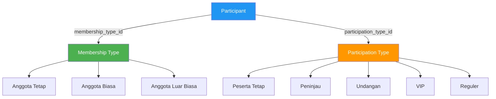

### Brief PM (3 Konsep)

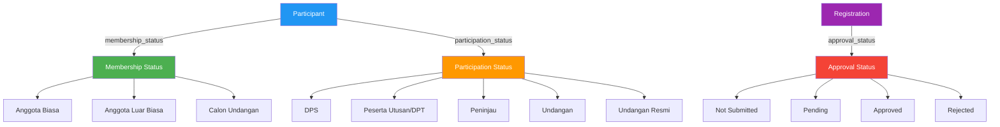

### Perbedaan Kunci

| Konsep | Dokumentasi Kita | Brief PM |
|--------|------------------|----------|
| **Membership** | Menentukan tipe anggota (Tetap/Biasa/Luar Biasa) | Menentukan kategori orang (Biasa/Luar Biasa/Calon Undangan) |
| **Participation** | Menentukan role di event ( Peserta Tetap/Peninjau/Undangan/VIP/Reguler) | Menentukan posisi di event (DPS/DPT/Peninjau/Undangan/Undangan Resmi) |
| **Approval** | Tidak ada (atau di Registration.status) | Terpisah di website HIPMI (Not Submitted/Pending/Approved/Rejected) |

---

## Perbedaan Naming Convention

| Field | Dokumentasi Kita | Brief PM | Keterangan |
|-------|------------------|----------|------------|
| Tipe Anggota | `membership_type` | `membership_status` | PM pakai "status" |
| Tipe Kepesertaan | `participation_type` | `participation_status` | PM pakai "status" |
| Status Registrasi | `Registration.status` | `approval_status` (di table terpisah) | PM pisahkan approval |
| Nama Model | `MembershipType` | `MembershipStatus` | PM rename |
| Nama Model | `ParticipationType` | `ParticipationStatus` | PM rename |

### Database Schema yang Diusulkan PM

**Tabel `membership_status` (rename dari `membership_type`):**

| Field | Tipe | Keterangan |
|-------|------|------------|
| id | UUID | Primary key |
| name | String | Anggota Biasa, Anggota Luar Biasa, Calon Undangan |
| slug | String | anggota-biasa, anggota-luar-biasa, calon-undangan |

**Tabel `participation_status` (rename dari `participation_type`):**

| Field | Tipe | Keterangan |
|-------|------|------------|
| id | UUID | Primary key |
| name | String | DPS, Peserta Utusan, Peninjau, Undangan, Undangan Resmi |
| slug | String | dps, peserta-utusan, peninjau, undangan, undangan-resmi |

**Tabel `participant_status_requests` (BARU - di website HIPMI):**

| Field | Tipe | Keterangan |
|-------|------|------------|
| id | UUID | Primary key |
| participant_id | UUID | FK → Participant |
| event_group_id | UUID | FK → EventGroup |
| current_status | String | DPS (status awal) |
| requested_status | String | DPT atau Peninjau |
| approval_status | String | not_submitted, pending, approved, rejected |
| notes | String | Catatan pengajuan |
| approved_by | String | Siapa yang approve |
| approved_at | DateTime | Kapan di-approve |

---

## Perbedaan Nilai Status

### Membership Status

| Dokumentasi Kita | Brief PM | Keterangan |
|------------------|----------|------------|
| Anggota Tetap | ❌ Tidak ada | PM tidak pakai "Tetap" |
| Anggota Biasa | ✅ Anggota Biasa | Sama |
| Anggota Luar Biasa | ✅ Anggota Luar Biasa | Sama |
| — | ✅ Calon Undangan | PM tambah kategori ini |

### Participation Status

| Dokumentasi Kita | Brief PM | Keterangan |
|------------------|----------|------------|
| Peserta Tetap | ❌ Tidak ada | PM tidak pakai "Tetap" |
| Peninjau | ✅ Peninjau | Sama |
| Undangan | ✅ Undangan | Sama |
| VIP | ❌ Tidak ada | PM tidak pakai VIP |
| Reguler | ❌ Tidak ada | PM tidak pakai Reguler |
| — | ✅ DPS | Status awal registrasi |
| — | ✅ Peserta Utusan (DPT) | Hasil approval dari DPS |
| — | ✅ Undangan Resmi | Untuk Calon Undangan |

### Approval Status (BARU)

| Dokumentasi Kita | Brief PM | Keterangan |
|------------------|----------|------------|
| Tidak ada | ✅ Not Submitted | Belum mengajukan |
| Tidak ada | ✅ Pending | Sedang review |
| Tidak ada | ✅ Approved | Disetujui |
| Tidak ada | ✅ Rejected | Ditolak |

---

## Perbedaan Arsitektur Data

### Dokumentasi Kita

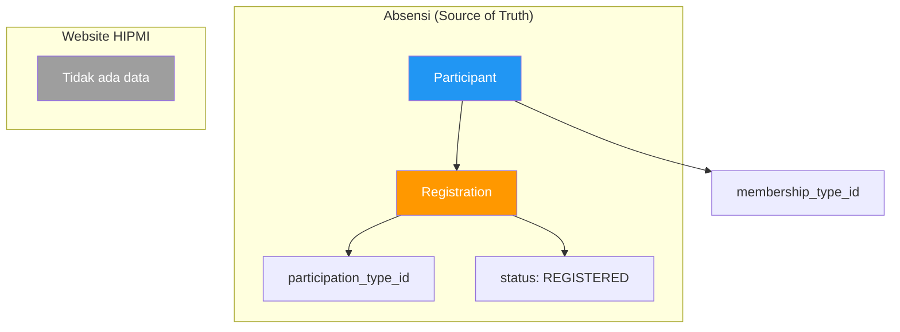

### Brief PM

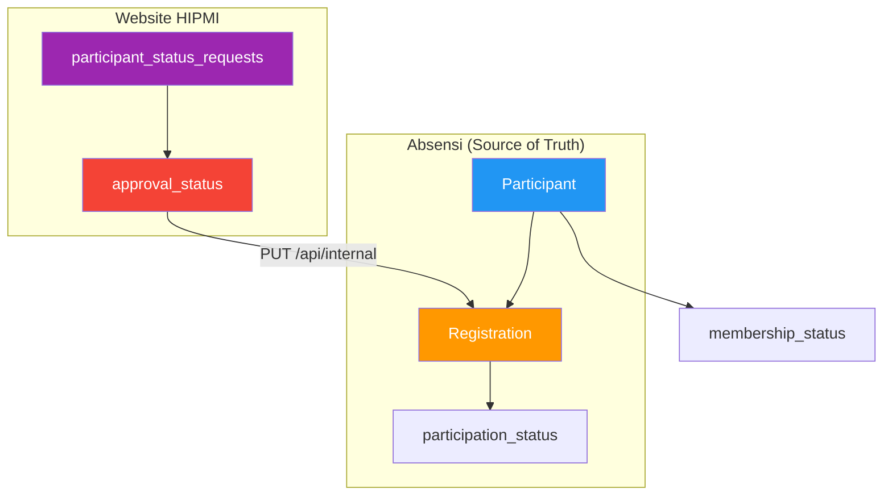

### Perbedaan Kunci

| Aspek | Dokumentasi Kita | Brief PM |
|-------|------------------|----------|
| **Approval disimpan di** | Absensi (Registration.status) | Website HIPMI (participant_status_requests) |
| **Source of Truth status** | Absensi untuk semua | Absensi untuk participation, HIPMI untuk approval |
| **Flow approval** | Admin langsung ubah status di absensi | Peserta submit di HIPMI → Admin approve → HIPMI call API absensi |
| **Data duplikasi** | Tidak ada | Tidak ada (approval hanya di HIPMI) |

---

## Perbedaan API

### Endpoint yang Ada (Perlu Diubah)

| Endpoint | Dokumentasi Kita | Brief PM | Yang Perlu Diubah |
|----------|------------------|----------|-------------------|
| `GET /daftar-pemilih-sementara` | Return `membership_type` | Return `membership_status` + `participation_status` | Ubah response |
| `GET /participant/check-by-id` | Cek apakah participant ada | Cek status kepesertaan di event | Extend response |
| `GET /participant/check` | Return `participation_type` | Return `participation_status` | Ubah response |

### Endpoint Baru

| Endpoint | Dokumentasi Kita | Brief PM | Keterangan |
|----------|------------------|----------|------------|
| `GET /event-groups/:id` | ✅ Ada | ✅ Ada | Sama |
| `GET /event-groups/:id/events` | ✅ Ada | - | PM tidak sebut |
| `GET /event-groups/:id/attendance` | ✅ Ada | - | PM tidak sebut |
| `GET /event-groups/:id/registrations` | ✅ Ada | - | PM tidak sebut |
| `GET /participant/:id/attendance` | ✅ Ada | - | PM tidak sebut |
| `GET /analytics/summary` | ✅ Ada | - | PM tidak sebut |
| `GET /participant/event-status` | ❌ Tidak ada | ✅ BARU | Cek status kepesertaan event |
| `PUT /registrations/:id/participation-status` | ❌ Tidak ada | ✅ BARU (internal) | Update participation status |

### Response Baru: `GET /api/public/participant/event-status`

```json
{
  "found": true,
  "participant": {
    "id": "uuid",
    "name": "Peserta 1 Santoso",
    "company": "PT ABC",
    "identification_number": "3273..."
  },
  "membership_status": {
    "name": "Anggota Biasa",
    "slug": "anggota-biasa"
  },
  "registration": {
    "event_group": {
      "id": "xxx",
      "name": "MUSCAB BPC HIPMI Kota Bandung"
    },
    "participation_status": {
      "name": "DPS",
      "slug": "dps"
    },
    "approval": {
      "status": "not_submitted",
      "label": "Belum Mengajukan"
    }
  }
}
```

### Response Baru: `PUT /api/internal/registrations/:id/participation-status`

```json
// Request
{
  "participation_status": "dpt"
}

// Response
{
  "success": true,
  "registration": {
    "id": "uuid",
    "participation_status": {
      "name": "Peserta Utusan",
      "slug": "peserta-utusan"
    }
  }
}
```

---

## Lifecycle per Tipe Anggota

### Anggota Biasa

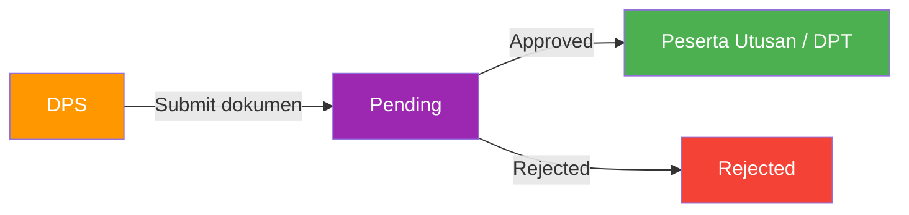

### Pengurus

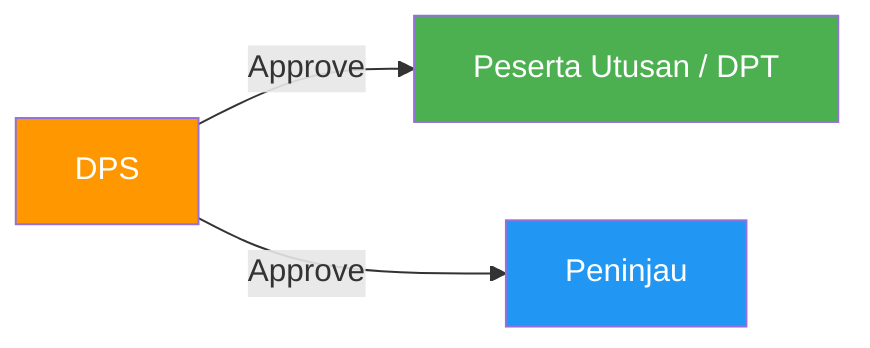

### Anggota Luar Biasa

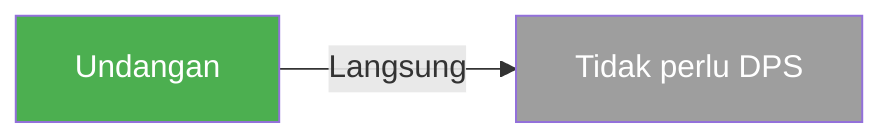

### Calon Undangan

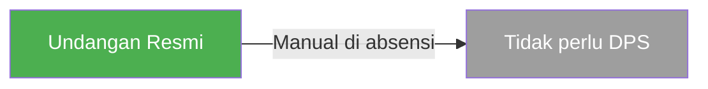

### Perbandingan Lifecycle

| Tipe Anggota | Dokumentasi Kita | Brief PM |
|--------------|------------------|----------|
| Anggota Biasa | Registrasi langsung → REGISTERED | DPS → Submit → Approval → DPT |
| Anggota Luar Biasa | Registrasi langsung → Undangan | Langsung Undangan (tanpa DPS) |
| Calon Undangan | Tidak ada | Manual → Undangan Resmi |
| Pengurus | Tidak ada | DPS → Approve → DPT atau Peninjau |

---

## Tabel Perbandingan Lengkap

| Aspek | Dokumentasi Kita | Brief PM | Status |
|-------|------------------|----------|--------|
| **Konsep** | 2 (membership + participation) | 3 (+ approval) | ⚠️ Perlu revisi |
| **Naming** | `membership_type` | `membership_status` | ⚠️ Perlu rename |
| **Naming** | `participation_type` | `participation_status` | ⚠️ Perlu rename |
| **Membership Values** | Tetap, Biasa, Luar Biasa | Biasa, Luar Biasa, Calon Undangan | ⚠️ Perlu revisi |
| **Participation Values** | Peserta Tetap, Peninjau, Undangan, VIP, Reguler | DPS, DPT, Peninjau, Undangan, Undangan Resmi | ⚠️ Perlu revisi |
| **Approval Workflow** | Di absensi | Di website HIPMI | ⚠️ Perlu arsitektur ulang |
| **Tabel Approval** | Tidak ada | `participant_status_requests` | ⚠️ Perlu buat baru |
| **DPS Concept** | Semua registrasi | Status awal sebelum approval | ⚠️ Perlu definisi ulang |
| **e-KTA Validation** | Belum ada | Ada (cek ke absensi) | ⚠️ Perlu implementasi |
| **API `/event-status`** | Tidak ada | Ada | ⚠️ Perlu buat baru |
| **API `/participation-status`** | Tidak ada | Ada (internal) | ⚠️ Perlu buat baru |
| **Auto Role Mapping** | `anggota-biasa → peserta-utusan` | Tidak ada (manual) | ❌ Berbeda |
| **Sync Method** | Manual CSV | Scraping/semi-otomatis | ⚠️ Perlu evaluasi |

---

## Gap yang Perlu Ditutup

### Gap 1: Pemisahan 3 Konsep Status

**Kondisi:** Kita masih campur aduk antara membership, participation, dan approval.

**Yang perlu dilakukan:**
1. Rename `MembershipType` → `MembershipStatus`
2. Rename `ParticipationType` → `ParticipationStatus`
3. Buat tabel `participant_status_requests` di website HIPMI
4. Pisahkan approval workflow dari absensi

### Gap 2: Naming Convention

**Kondisi:** Kita pakai "type" PM pakai "status".

**Yang perlu dilakukan:**
1. Rename semua field `membership_type` → `membership_status`
2. Rename semua field `participation_type` → `participation_status`
3. Update semua kode yang referensi field lama

### Gap 3: Nilai Status

**Kondisi:** Kita punya nilai yang tidak dipakai PM (VIP, Reguler, Peserta Tetap) dan PM punya nilai yang tidak ada di kita (DPS, DPT, Calon Undangan, Undangan Resmi).

**Yang perlu dilakukan:**
1. Hapus: VIP, Reguler, Peserta Tetap
2. Tambah: DPS, Peserta Utusan (DPT), Calon Undangan (membership), Undangan Resmi
3. Update seed data

### Gap 4: Approval Workflow

**Kondisi:** Kita belum ada approval workflow.

**Yang perlu dilakukan:**
1. Buat tabel `participant_status_requests` di website HIPMI
2. Implement flow: Submit → Pending → Approved/Rejected
3. Buat API internal untuk update participation status
4. Update frontend untuk show approval status

### Gap 5: API Baru

**Kondisi:** Kita belum punya endpoint untuk cek status kepesertaan event.

**Yang perlu dilakukan:**
1. Buat `GET /api/public/participant/event-status`
2. Buat `PUT /api/internal/registrations/:id/participation-status`
3. Update response endpoint yang sudah ada

### Gap 6: Lifecycle Anggota

**Kondisi:** Kita belum ada lifecycle per tipe anggota.

**Yang perlu dilakukan:**
1. Implement lifecycle Anggota Biasa: DPS → Submit → Approval → DPT
2. Implement lifecycle Anggota Luar Biasa: Langsung Undangan
3. Implement lifecycle Calon Undangan: Manual → Undangan Resmi
4. Implement lifecycle Pengurus: DPS → Approve → DPT/Peninjau

---

## Revisi Rekomendasi

### Prioritas 1: Rename Naming Convention (High)

| Item | Detail |
|------|--------|
| **Scope** | Database + Backend + Frontend |
| **Rename** | `MembershipType` → `MembershipStatus` |
| **Rename** | `ParticipationType` → `ParticipationStatus` |
| **Rename** | `membership_type` → `membership_status` |
| **Rename** | `participation_type` → `participation_status` |
| **Effort** | 2-3 hari |
| **Impact** | Konsisten dengan brief PM |

### Prioritas 2: Buat Tabel Approval (High)

| Item | Detail |
|------|--------|
| **Scope** | Website HIPMI (backend) |
| **Tabel** | `participant_status_requests` |
| **Fields** | participant_id, event_group_id, current_status, requested_status, approval_status, notes, approved_by, approved_at |
| **Effort** | 1-2 hari |
| **Impact** | Approval workflow terpisah |

### Prioritas 3: Update API Response (High)

| Item | Detail |
|------|--------|
| **Scope** | Backend public controller |
| **Update** | `/daftar-pemilih-sementara` → return `membership_status` + `participation_status` |
| **Update** | `/participant/check` → return `participation_status` |
| **Baru** | `GET /participant/event-status` |
| **Baru** | `PUT /registrations/:id/participation-status` (internal) |
| **Effort** | 2-3 hari |
| **Impact** | API sesuai brief PM |

### Prioritas 4: Update Status Values (Medium)

| Item | Detail |
|------|--------|
| **Scope** | Database seed + Backend logic |
| **Membership** | Hapus "Tetap", tambah "Calon Undangan" |
| **Participation** | Hapus "Peserta Tetap", "VIP", "Reguler"; tambah "DPS", "Peserta Utusan", "Undangan Resmi" |
| **Effort** | 1 hari |
| **Impact** | Nilai status sesuai brief PM |

### Prioritas 5: Implement Lifecycle (Medium)

| Item | Detail |
|------|--------|
| **Scope** | Backend + Frontend |
| **Lifecycle** | Anggota Biasa: DPS → DPT |
| **Lifecycle** | Anggota Luar Biasa: Langsung Undangan |
| **Lifecycle** | Calon Undangan: Manual → Undangan Resmi |
| **Effort** | 3-5 hari |
| **Impact** | Alur kepesertaan sesuai brief PM |

---

## Ringkasan Effort (Revisi)

| Prioritas | Item | Effort | Impact |
|-----------|------|--------|--------|
| **P1** | Rename Naming Convention | 2-3 hari | High |
| **P2** | Buat Tabel Approval | 1-2 hari | High |
| **P3** | Update API Response | 2-3 hari | High |
| **P4** | Update Status Values | 1 hari | Medium |
| **P5** | Implement Lifecycle | 3-5 hari | Medium |
| | **Total** | **9-14 hari** | |

---

## Status Dokumen — Perbandingan

| Item | Status |
|------|--------|
| Perbandingan Konsep | ✅ Terdokumentasi |
| Perbedaan Naming | ✅ Terdokumentasi |
| Perbedaan API | ✅ Terdokumentasi |
| Gap Analysis | ✅ Terdokumentasi |
| Revisi Rekomendasi | ✅ Terdokumentasi |
| Keputusan PM | ⏳ Menunggu |
| Implementasi | ⏳ Belum Mulai |
