# Perbandingan: Brief PM vs Dokumentasi Kita

**Date:** 15 August 2026  
**Status:** Analisis Perbandingan  
**Sumber Kita:** `docs/alur-pendaftaran/INTEGRASI_3_WEBSITE.md`  
**Sumber PM:** wiki.langgenginovasiteknologi.com/s/e613d0f2-4afb-4475-9c7d-216e2a61c404

---

## Daftar Isi

1. [Ringkasan Eksekutif](#ringkasan-eksekutif)
2. [Perbandingan Konsep Status](#perbandingan-konsep-status)
3. [Perbandingan Naming Convention](#perbandingan-naming-convention)
4. [Perbandingan Nilai Status](#perbandingan-nilai-status)
5. [Perbandingan Arsitektur Data](#perbandingan-arsitektur-data)
6. [Perbandingan API](#perbandingan-api)
7. [Perbandingan Lifecycle](#perbandingan-lifecycle)
8. [Tabel Perbandingan Lengkap](#tabel-perbandingan-lengkap)
9. [Gap Analysis](#gap-analysis)
10. [Rekomendasi Implementasi](#rekomendasi-implementasi)

---

## Ringkasan Eksekutif

### Apa yang Sama

| Aspek | Keterangan |
|-------|------------|
| **Source of Truth** | Absensi tetap jadi sumber utama data peserta |
| **Arsitektur 3 Website** | HIPMIGO → Absensi → Website HIPMI |
| **Data Flow** | On-demand pull via public API |
| **Role Absensi** | Mengelola participant, registration, attendance |

### Apa yang Berbeda

| Aspek | Dokumentasi Kita | Brief PM |
|-------|------------------|----------|
| **Jumlah Konsep** | 2 (membership + participation) | 3 (+ approval terpisah) |
| **Naming** | `membership_type`, `participation_type` | `membership_status`, `participation_status` |
| **Lokasi Approval** | Di absensi (Registration.status) | Di website HIPMI (table terpisah) |
| **DPS Concept** | Semua registrasi = DPS | DPS = status awal, ada transisi ke DPT |
| **Status Values** | Lebih banyak (VIP, Reguler, Peserta Tetap) | Lebih spesifik (DPS, DPT, Calon Undangan) |
| **e-KTA Validation** | Belum ada | Sudah ada (cek ke absensi) |

---

## Perbandingan Konsep Status

### Dokumentasi Kita: 2 Konsep

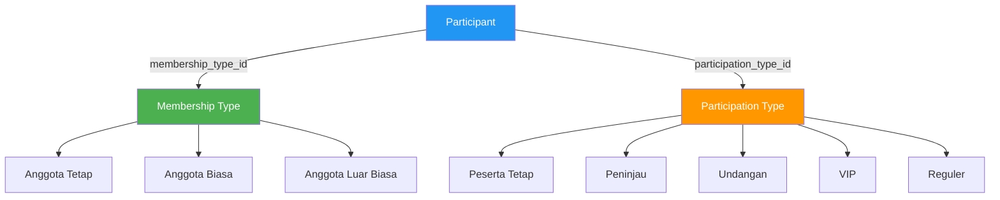

**Karakteristik:**
- Membership menentukan tipe anggota (Tetap/Biasa/Luar Biasa)
- Participation menentukan role di event (Peserta Tetap/Peninjau/Undangan/VIP/Reguler)
- Tidak ada approval workflow terpisah

### Brief PM: 3 Konsep

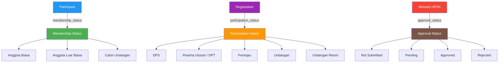

**Karakteristik:**
- Membership menjelaskan kategori orang secara organisasi
- Participation menjelaskan posisi orang dalam event tertentu
- Approval menjelaskan proses verifikasi administratif
- Approval terpisah di website HIPMI, bukan di absensi

### Perbandingan

| Aspek | Kita | PM | Kesimpulan |
|-------|------|-----|------------|
| **Jumlah konsep** | 2 | 3 | PM lebih granular |
| **Lokasi approval** | Absensi | Website HIPMI | PM split responsibility |
| **Fokus** | Semua di satu tempat | Pisah berdasarkan fungsi | PM lebih terstruktur |

---

## Perbandingan Naming Convention

### Field Naming

| Field | Dokumentasi Kita | Brief PM | Status |
|-------|------------------|----------|--------|
| Tipe Anggota | `membership_type` | `membership_status` | ⚠️ Perlu rename |
| Tipe Kepesertaan | `participation_type` | `participation_status` | ⚠️ Perlu rename |
| Status Registrasi | `Registration.status` | `approval_status` (table terpisah) | ⚠️ Perlu pisahkan |

### Model Naming

| Model | Dokumentasi Kita | Brief PM | Status |
|-------|------------------|----------|--------|
| Tipe Anggota | `MembershipType` | `MembershipStatus` | ⚠️ Perlu rename |
| Tipe Kepesertaan | `ParticipationType` | `ParticipationStatus` | ⚠️ Perlu rename |
| Approval | Tidak ada | `ParticipantStatusRequest` | ⚠️ Perlu buat baru |

### Database Table Naming

| Table | Dokumentasi Kita | Brief PM | Status |
|-------|------------------|----------|--------|
| Tipe Anggota | `membership_types` | `membership_status` | ⚠️ Perlu rename |
| Tipe Kepesertaan | `participation_types` | `participation_status` | ⚠️ Perlu rename |
| Approval | Tidak ada | `participant_status_requests` | ⚠️ Perlu buat baru |

---

## Perbandingan Nilai Status

### Membership Status

| Dokumentasi Kita | Brief PM | Status |
|------------------|----------|--------|
| Anggota Tetap | ❌ Tidak ada | ⚠️ Hapus |
| Anggota Biasa | ✅ Anggota Biasa | ✅ Sama |
| Anggota Luar Biasa | ✅ Anggota Luar Biasa | ✅ Sama |
| — | ✅ Calon Undangan | ⚠️ Tambah |

### Participation Status

| Dokumentasi Kita | Brief PM | Status |
|------------------|----------|--------|
| Peserta Tetap | ❌ Tidak ada | ⚠️ Hapus |
| Peninjau | ✅ Peninjau | ✅ Sama |
| Undangan | ✅ Undangan | ✅ Sama |
| VIP | ❌ Tidak ada | ⚠️ Hapus |
| Reguler | ❌ Tidak ada | ⚠️ Hapus |
| — | ✅ DPS | ⚠️ Tambah |
| — | ✅ Peserta Utusan (DPT) | ⚠️ Tambah |
| — | ✅ Undangan Resmi | ⚠️ Tambah |

### Approval Status (BARU)

| Dokumentasi Kita | Brief PM | Status |
|------------------|----------|--------|
| Tidak ada | ✅ Not Submitted | ⚠️ Tambah |
| Tidak ada | ✅ Pending | ⚠️ Tambah |
| Tidak ada | ✅ Approved | ⚠️ Tambah |
| Tidak ada | ✅ Rejected | ⚠️ Tambah |

### Ringkasan Perubahan

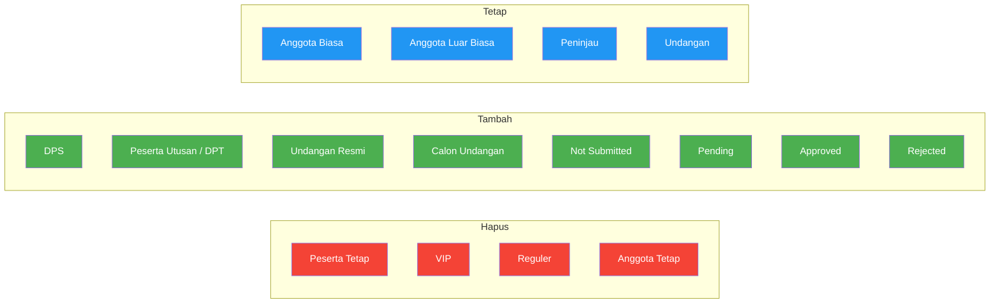

---

## Perbandingan Arsitektur Data

### Dokumentasi Kita

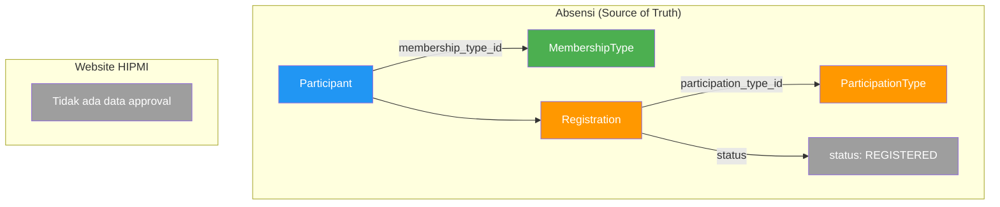

**Karakteristik:**
- Semua data di absensi
- Approval langsung di Registration.status
- Tidak ada tabel terpisah untuk approval

### Brief PM

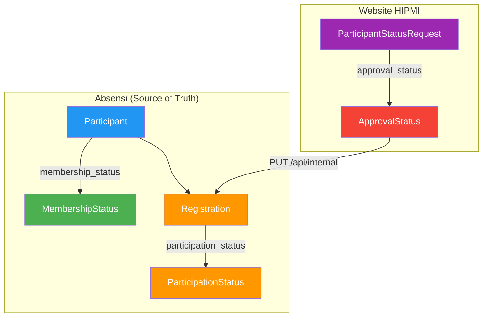

**Karakteristik:**
- Absensi: source of truth untuk participant, membership, participation
- Website HIPMI: source of truth untuk approval workflow
- Approval dipisahkan ke tabel `participant_status_requests`

### Perbandingan

| Aspek | Dokumentasi Kita | Brief PM |
|-------|------------------|----------|
| **Lokasi approval** | Absensi (Registration.status) | Website HIPMI (participant_status_requests) |
| **Source of truth** | Absensi untuk semua | Absensi untuk status, HIPMI untuk approval |
| **Flow approval** | Admin langsung ubah di absensi | Peserta submit di HIPMI → Admin approve → HIPMI call API absensi |
| **Data duplikasi** | Tidak ada | Tidak ada (approval hanya di HIPMI) |

---

## Perbandingan API

### Endpoint yang Perlu Diubah

| Endpoint | Response Saat Ini | Response yang Diinginkan PM |
|----------|-------------------|----------------------------|
| `GET /daftar-pemilih-sementara` | `membership_type: { name, slug }` | `membership_status: { name, slug }` + `participation_status: { name, slug }` |
| `GET /participant/check-by-id` | Cek apakah participant ada | Cek status kepesertaan di event |
| `GET /participant/check` | `participation_type: { name }` | `participation_status: { name, slug }` |

### Endpoint Baru

| Endpoint | Dokumentasi Kita | Brief PM | Keterangan |
|----------|------------------|----------|------------|
| `GET /event-groups/:id` | ✅ Ada | ✅ Ada | Sama |
| `GET /event-groups/:id/events` | ✅ Ada | - | PM tidak sebut |
| `GET /event-groups/:id/attendance` | ✅ Ada | - | PM tidak sebut |
| `GET /event-groups/:id/registrations` | ✅ Ada | - | PM tidak sebut |
| `GET /participant/:id/attendance` | ✅ Ada | - | PM tidak sebut |
| `GET /analytics/summary` | ✅ Ada | - | PM tidak sebut |
| `GET /participant/event-status` | ❌ Tidak ada | ✅ BARU | Cek status kepesertaan event |
| `PUT /registrations/:id/participation-status` | ❌ Tidak ada | ✅ BARU (internal) | Update participation status |

### Response Baru: `GET /api/public/participant/event-status`

```json
{
  "found": true,
  "participant": {
    "id": "uuid",
    "name": "Peserta 1 Santoso",
    "company": "PT ABC",
    "identification_number": "3273..."
  },
  "membership_status": {
    "name": "Anggota Biasa",
    "slug": "anggota-biasa"
  },
  "registration": {
    "event_group": {
      "id": "xxx",
      "name": "MUSCAB BPC HIPMI Kota Bandung"
    },
    "participation_status": {
      "name": "DPS",
      "slug": "dps"
    },
    "approval": {
      "status": "not_submitted",
      "label": "Belum Mengajukan"
    }
  }
}
```

### Response Baru: `PUT /api/internal/registrations/:id/participation-status`

```json
// Request
{
  "participation_status": "peserta-utusan"
}

// Response
{
  "success": true,
  "registration": {
    "id": "uuid",
    "participation_status": {
      "name": "Peserta Utusan",
      "slug": "peserta-utusan"
    }
  }
}
```

---

## Perbandingan Lifecycle

### Anggota Biasa

**Dokumentasi Kita:**
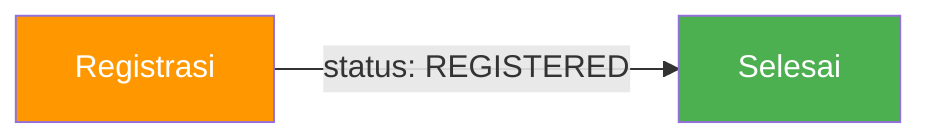

**Brief PM:**
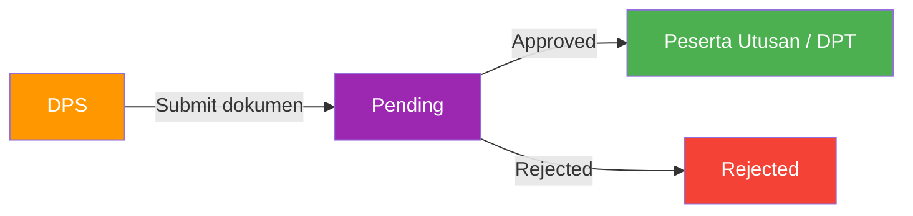

### Pengurus

**Dokumentasi Kita:**


**Brief PM:**
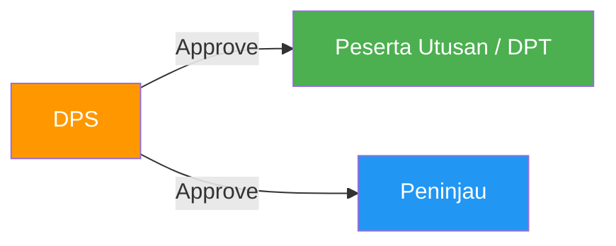

### Anggota Luar Biasa

**Dokumentasi Kita:**


**Brief PM:**
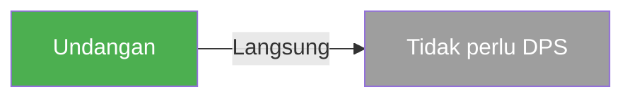

### Calon Undangan

**Dokumentasi Kita:**
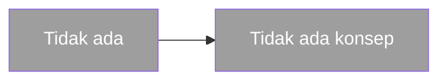

**Brief PM:**
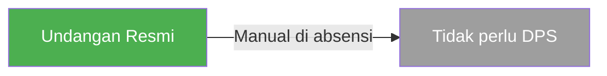

### Perbandingan Lifecycle

| Tipe Anggota | Dokumentasi Kita | Brief PM |
|--------------|------------------|----------|
| Anggota Biasa | Registrasi langsung → REGISTERED | DPS → Submit → Approval → DPT |
| Pengurus | Registrasi langsung → REGISTERED | DPS → Approve → DPT atau Peninjau |
| Anggota Luar Biasa | Registrasi langsung → Undangan | Langsung Undangan (tanpa DPS) |
| Calon Undangan | Tidak ada | Manual → Undangan Resmi |

---

## Tabel Perbandingan Lengkap

| Aspek | Dokumentasi Kita | Brief PM | Status |
|-------|------------------|----------|--------|
| **Konsep** | 2 (membership + participation) | 3 (+ approval) | ⚠️ Perlu revisi |
| **Naming** | `membership_type` | `membership_status` | ⚠️ Perlu rename |
| **Naming** | `participation_type` | `participation_status` | ⚠️ Perlu rename |
| **Membership Values** | Tetap, Biasa, Luar Biasa | Biasa, Luar Biasa, Calon Undangan | ⚠️ Perlu revisi |
| **Participation Values** | Peserta Tetap, Peninjau, Undangan, VIP, Reguler | DPS, DPT, Peninjau, Undangan, Undangan Resmi | ⚠️ Perlu revisi |
| **Approval Workflow** | Di absensi | Di website HIPMI | ⚠️ Perlu arsitektur ulang |
| **Tabel Approval** | Tidak ada | `participant_status_requests` | ⚠️ Perlu buat baru |
| **DPS Concept** | Semua registrasi | Status awal sebelum approval | ⚠️ Perlu definisi ulang |
| **e-KTA Validation** | Belum ada | Ada (cek ke absensi) | ⚠️ Perlu implementasi |
| **API `/event-status`** | Tidak ada | Ada | ⚠️ Perlu buat baru |
| **API `/participation-status`** | Tidak ada | Ada (internal) | ⚠️ Perlu buat baru |
| **Auto Role Mapping** | `anggota-biasa → peserta-utusan` | Path transisi DPS → Peserta Utusan (default) / Peninjau, di-enforce di internal API; mapping konsep → slug via settings web | ✅ Diimplementasi |
| **Sync Method** | Manual CSV | Scraping/semi-otomatis | ⚠️ Perlu evaluasi |

---

## Gap Analysis

### Gap 1: Pemisahan 3 Konsep Status

**Kondisi:** Kita masih campur aduk antara membership, participation, dan approval.

**Yang perlu dilakukan:**
1. Rename `MembershipType` → `MembershipStatus`
2. Rename `ParticipationType` → `ParticipationStatus`
3. Buat tabel `participant_status_requests` di website HIPMI
4. Pisahkan approval workflow dari absensi

### Gap 2: Naming Convention

**Kondisi:** Kita pakai "type" PM pakai "status".

**Yang perlu dilakukan:**
1. Rename semua field `membership_type` → `membership_status`
2. Rename semua field `participation_type` → `participation_status`
3. Update semua kode yang referensi field lama

### Gap 3: Nilai Status

**Kondisi:** Kita punya nilai yang tidak dipakai PM (VIP, Reguler, Peserta Tetap) dan PM punya nilai yang tidak ada di kita (DPS, DPT, Calon Undangan, Undangan Resmi).

**Yang perlu dilakukan:**
1. Hapus: VIP, Reguler, Peserta Tetap
2. Tambah: DPS, Peserta Utusan (DPT), Calon Undangan (membership), Undangan Resmi
3. Update seed data

### Gap 4: Approval Workflow

**Kondisi:** Kita belum ada approval workflow.

**Yang perlu dilakukan:**
1. Buat tabel `participant_status_requests` di website HIPMI
2. Implement flow: Submit → Pending → Approved/Rejected
3. Buat API internal untuk update participation status
4. Update frontend untuk show approval status

### Gap 5: API Baru

**Kondisi:** Kita belum punya endpoint untuk cek status kepesertaan event.

**Yang perlu dilakukan:**
1. Buat `GET /api/public/participant/event-status`
2. Buat `PUT /api/internal/registrations/:id/participation-status`
3. Update response endpoint yang sudah ada

### Gap 6: Lifecycle Anggota

**Kondisi:** Kita belum ada lifecycle per tipe anggota.

**Yang perlu dilakukan:**
1. Implement lifecycle Anggota Biasa: DPS → Submit → Approval → DPT
2. Implement lifecycle Anggota Luar Biasa: Langsung Undangan
3. Implement lifecycle Calon Undangan: Manual → Undangan Resmi
4. Implement lifecycle Pengurus: DPS → Approve → DPT/Peninjau

---

## Rekomendasi Implementasi

### Prioritas 1: Rename Naming Convention (High)

| Item | Detail |
|------|--------|
| **Scope** | Database + Backend + Frontend |
| **Rename** | `MembershipType` → `MembershipStatus` |
| **Rename** | `ParticipationType` → `ParticipationStatus` |
| **Rename** | `membership_type` → `membership_status` |
| **Rename** | `participation_type` → `participation_status` |
| **Effort** | 2-3 hari |
| **Impact** | Konsisten dengan brief PM |

### Prioritas 2: Buat Tabel Approval (High)

| Item | Detail |
|------|--------|
| **Scope** | Website HIPMI (backend) |
| **Tabel** | `participant_status_requests` |
| **Fields** | participant_id, event_group_id, current_status, requested_status, approval_status, notes, approved_by, approved_at |
| **Effort** | 1-2 hari |
| **Impact** | Approval workflow terpisah |

### Prioritas 3: Update API Response (High)

| Item | Detail |
|------|--------|
| **Scope** | Backend public controller |
| **Update** | `/daftar-pemilih-sementara` → return `membership_status` + `participation_status` |
| **Update** | `/participant/check` → return `participation_status` |
| **Baru** | `GET /participant/event-status` |
| **Baru** | `PUT /registrations/:id/participation-status` (internal) |
| **Effort** | 2-3 hari |
| **Impact** | API sesuai brief PM |

### Prioritas 4: Update Status Values (Medium)

| Item | Detail |
|------|--------|
| **Scope** | Database seed + Backend logic |
| **Membership** | Hapus "Tetap", tambah "Calon Undangan" |
| **Participation** | Hapus "Peserta Tetap", "VIP", "Reguler"; tambah "DPS", "Peserta Utusan", "Undangan Resmi" |
| **Effort** | 1 hari |
| **Impact** | Nilai status sesuai brief PM |

### Prioritas 5: Implement Lifecycle (Medium)

| Item | Detail |
|------|--------|
| **Scope** | Backend + Frontend |
| **Lifecycle** | Anggota Biasa: DPS → DPT |
| **Lifecycle** | Anggota Luar Biasa: Langsung Undangan |
| **Lifecycle** | Calon Undangan: Manual → Undangan Resmi |
| **Effort** | 3-5 hari |
| **Impact** | Alur kepesertaan sesuai brief PM |

---

## Ringkasan Effort

| Prioritas | Item | Effort | Impact |
|-----------|------|--------|--------|
| **P1** | Rename Naming Convention | 2-3 hari | High |
| **P2** | Buat Tabel Approval | 1-2 hari | High |
| **P3** | Update API Response | 2-3 hari | High |
| **P4** | Update Status Values | 1 hari | Medium |
| **P5** | Implement Lifecycle | 3-5 hari | Medium |
| | **Total** | **9-14 hari** | |

---

## Status Dokumen

| Item | Status |
|------|--------|
| Perbandingan Konsep | ✅ Terdokumentasi |
| Perbedaan Naming | ✅ Terdokumentasi |
| Perbedaan API | ✅ Terdokumentasi |
| Gap Analysis | ✅ Terdokumentasi |
| Rekomendasi Implementasi | ✅ Terdokumentasi |
| Keputusan PM | ⏳ Menunggu |
| Implementasi | ⏳ Belum Mulai |
